# Frontend Mentor - Multi-step form solution

This is a solution to the [Multi-step form challenge on Frontend Mentor](https://www.frontendmentor.io/challenges/multistep-form-YVAnSdqQBJ). Frontend Mentor challenges help you improve your coding skills by building realistic projects. 

## Table of contents

- [Frontend Mentor - Multi-step form solution](#frontend-mentor---multi-step-form-solution)
  - [Table of contents](#table-of-contents)
    - [The challenge](#the-challenge)
    - [Screenshot](#screenshot)
    - [Built with](#built-with)
    - [What I learned](#what-i-learned)
    - [Continued development](#continued-development)
  - [Author](#author)


### The challenge

Users should be able to:

- Complete each step of the sequence
- Go back to a previous step to update their selections
- See a summary of their selections on the final step and confirm their order
- View the optimal layout for the interface depending on their device's screen size
- See hover and focus states for all interactive elements on the page
- Receive form validation messages if:
  - A field has been missed
  - The email address is not formatted correctly
  - A step is submitted, but no selection has been made

### Screenshot
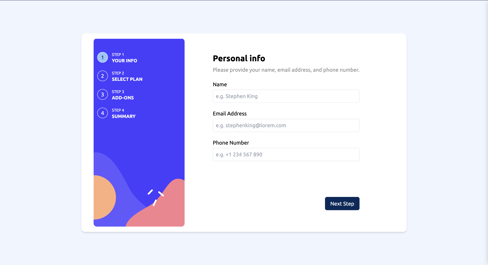
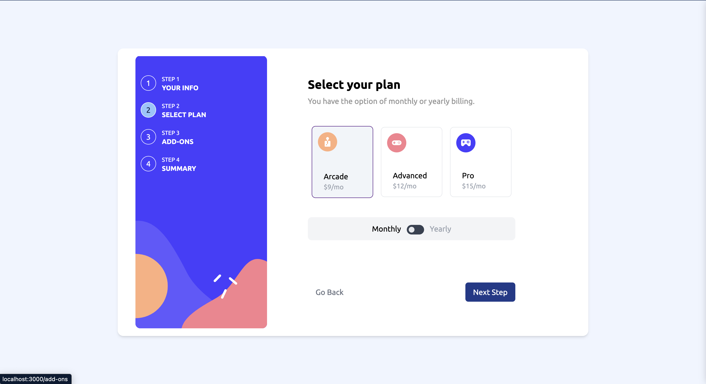
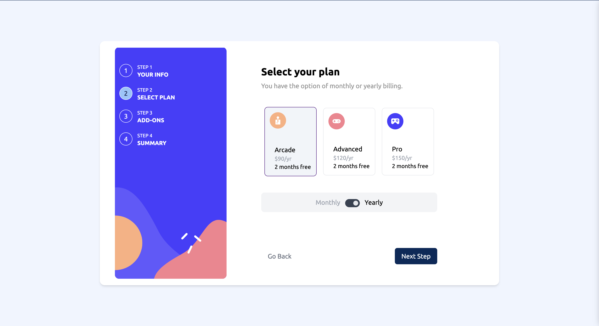
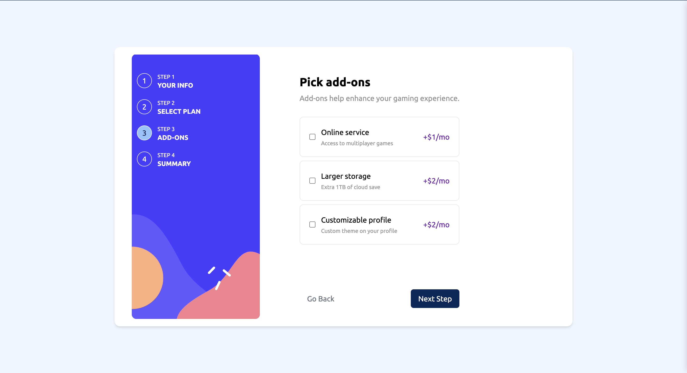
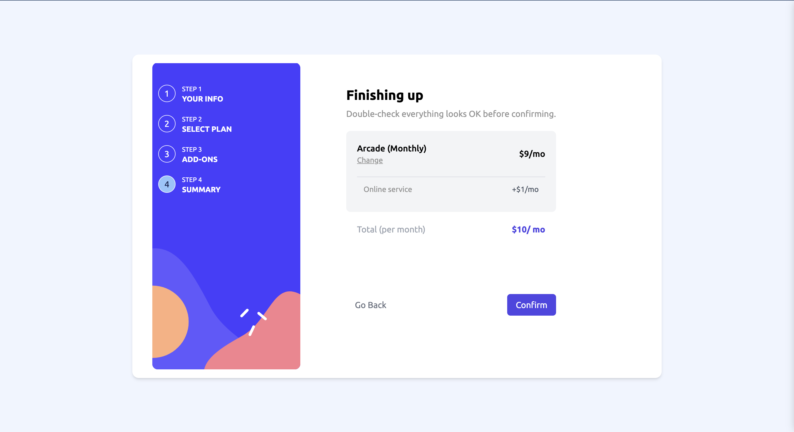
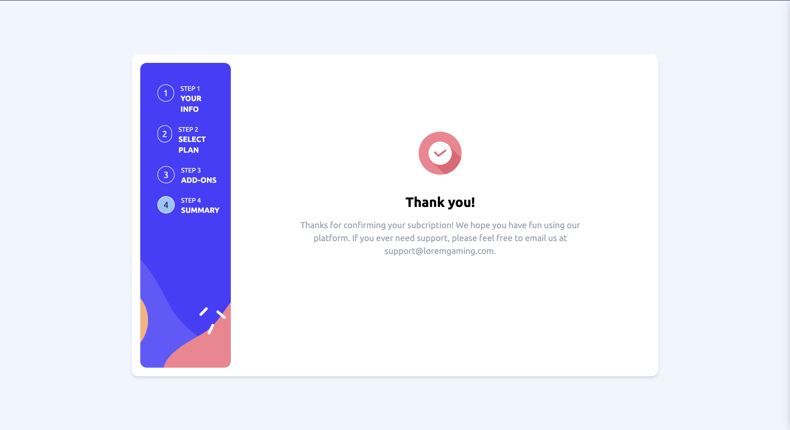
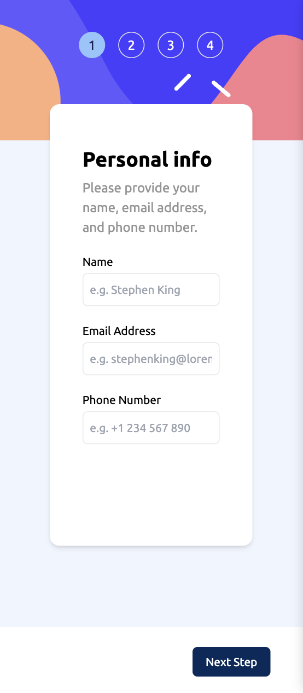
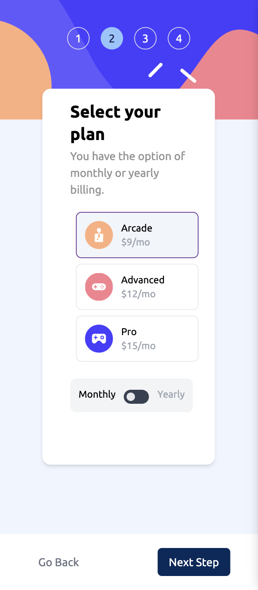
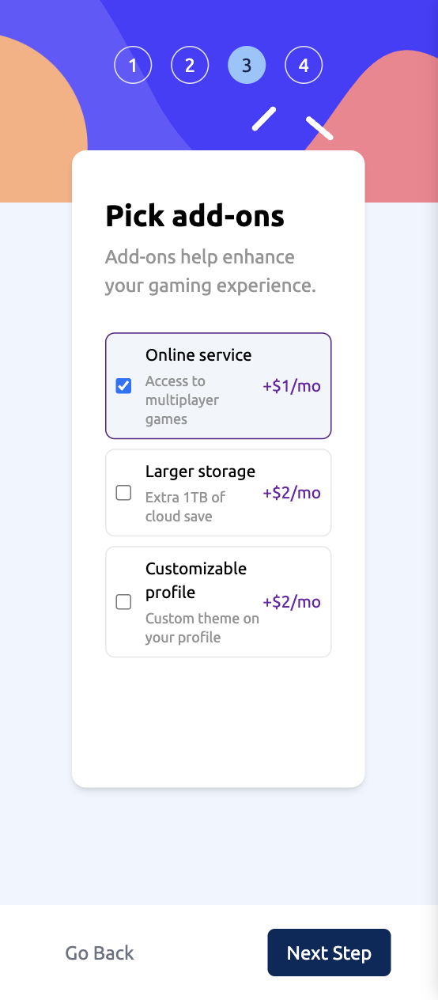
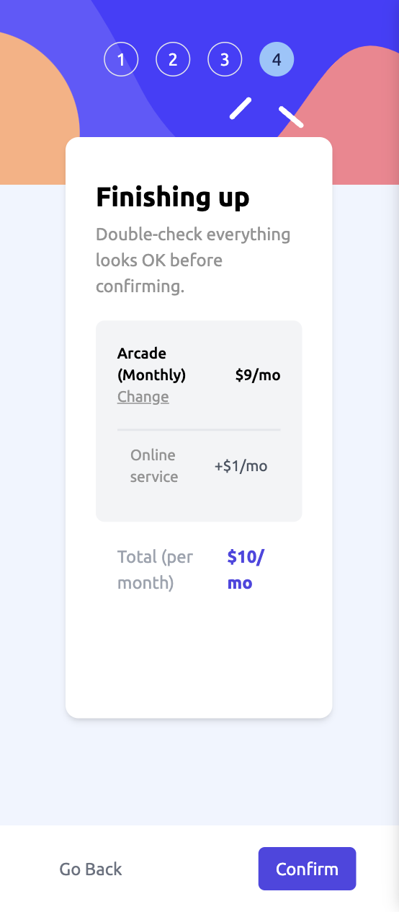
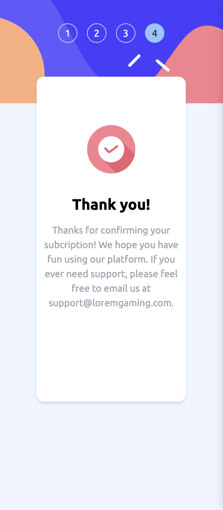


### Built with

- Tailwind css (https://tailwindcss.com/docs/guides/create-react-app)
- [React](https://reactjs.org/) - JS library


### What I learned


```React

          <Routes>

            <Route path='/' element={<YourInfo setStep={setStep} />}/>

            <Route path='/select-plan' element={<SelectPlan setStep={setStep} plan={plan} setPlan={setPlan} period={period} setPeriod={setPeriod} />}/>

            <Route path='/add-ons' element={<AddOns setStep={setStep} online={online} setOnline={setOnline} storage={storage} setStorage={setStorage} profile={profile} setProfile={setProfile} period={period} />}/>

            <Route path='/summary' element={<Summary setStep={setStep} plan={plan} period={period} setPeriod={setPeriod} online={online} storage={storage} profile={profile}/>}/>

            <Route path='/thank-you' element={<ThankYou />}/>
          </Routes>

          


          ----------------------------------------------------------------

            <Formik initialValues={{
                name: "",
                email: "",
                phone: "",

            }}

                onSubmit={(values) => {
                    
                    values.name = '';
                    values.email = '';
                    values.phone = '';
                    handleNext();
                   
                }}


                validate={(values) => {
                    const errors = {};


                    if (values.name === '') {

                        errors.name = 'Name is required';
                    }

                    if (values.email === '') {

                        errors.email = 'Provide valid email';
                    } else if (!values.email.match(/^[a-zA-Z0-9.!#$%&’*+/=?^_`{|}~-]+@[a-zA-Z0-9-]+(?:\.[a-zA-Z0-9-]+)*$/)) {
                        errors.email = 'This is not a valid email'
                    }

                    if (values.phone === '') {

                        errors.phone = 'Phone is required';
                    }

                    return errors;
                }}
            >


                <Form className="form-registration max-sm:text-sm" action="index.html" enctype="multipart/form-data">


                    <div className='flex justify-between '>
                        <label for="name" >Name</label> <ErrorMessage name='name' >
                            {(errorMsg) => <div className="error text-red-600 ">{errorMsg}</div>}
                        </ErrorMessage>
                    </div>
                    <Field type="text" name="name" className="name border  w-full rounded-md h-10 mt-1 mb-5 p-2 outline-none hover:border-purple-800 focus:border-purple-800" placeholder="e.g. Stephen King" />


                    <div className='flex justify-between'>
                        <label for="email">Email Address</label>
                        <ErrorMessage name='email' >
                            {(errorMsg) => <div className="error text-red-600 ">{errorMsg}</div>}
                        </ErrorMessage>
                    </div>
                    <Field type="email" name="email" className="email border w-full rounded-md h-10 mt-1 mb-5 p-2 outline-none hover:border-purple-800 focus:border-purple-800" placeholder="e.g. stephenking@lorem.com" />


                    <div className='flex justify-between'>

                        <label for="phone">Phone Number</label> <ErrorMessage name='phone' >
                            {(errorMsg) => <div className="error text-red-600 ">{errorMsg}</div>}
                        </ErrorMessage>
                    </div>
                    <Field type="phone" name="phone" className="phone border w-full rounded-md h-10 mt-1 mb-5 p-2 outline-none hover:border-purple-800 focus:border-purple-800" placeholder="e.g. +1 234 567 890" />


                    <div className='relative  w-full h-32 max-md:bg-white  max-md:absolute max-md:bottom-0 max-md:left-0 max-md:h-20 '>
                        <button className="submit absolute bottom-0 max-md:bottom-5 max-md:right-10  right-0 py-2 px-4 rounded-md hover:bg-blue-900" type="submit" >Next Step</button>
                    </div>
                   
                </Form>

            </Formik>

```


### Continued development

I want to learn more about Redux and Hooks in React.


## Author

- Website - [Amir FAmili](https://www.amirfamili.com)
- Frontend Mentor - [@AmirFamili](https://www.frontendmentor.io/profile/amirfamili)


